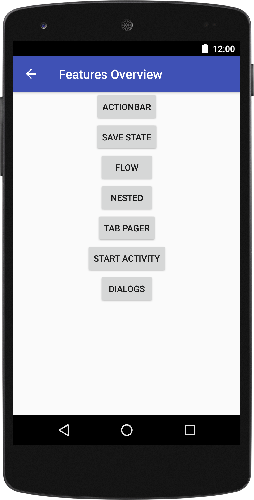
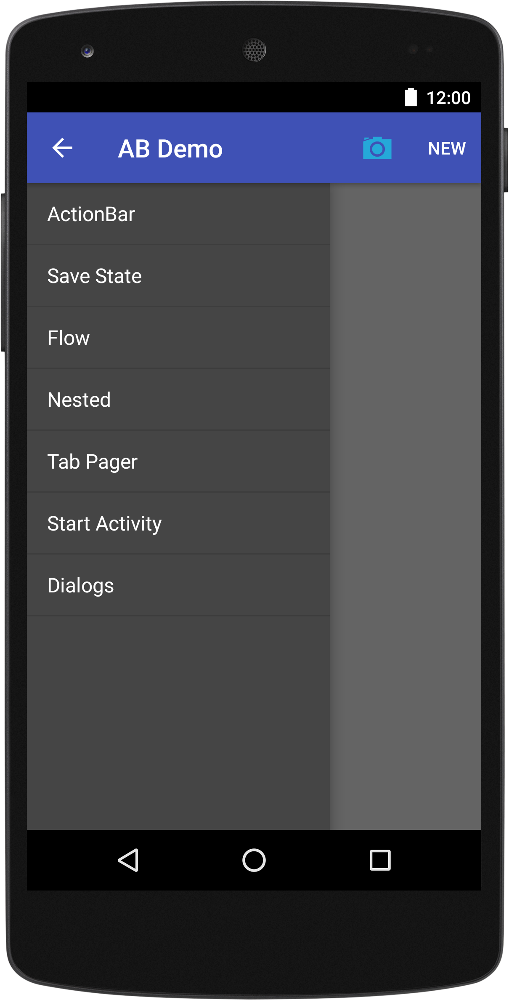
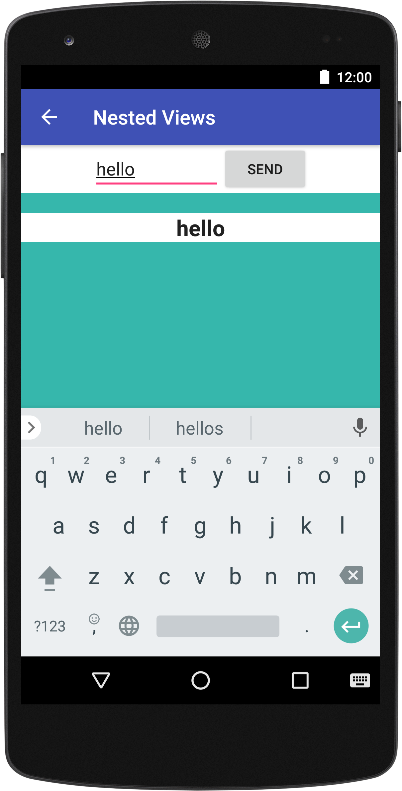
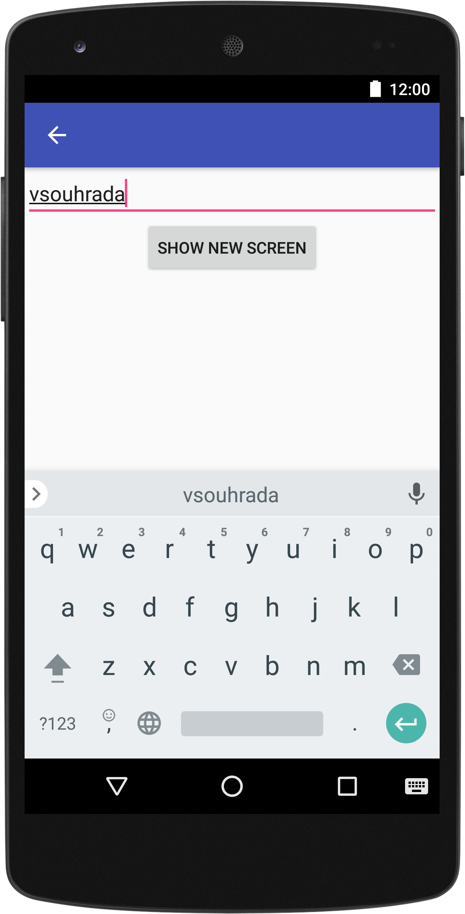
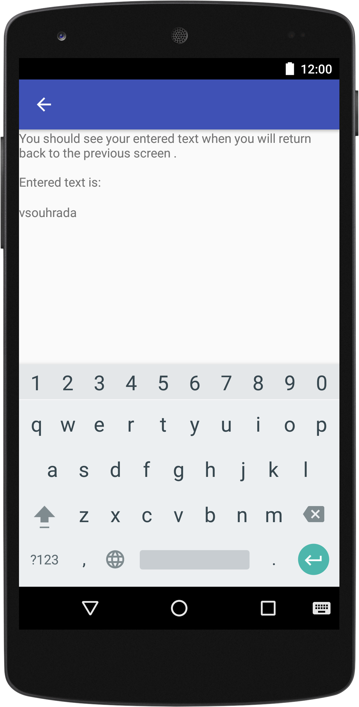

# lib-mflow
Android Framework - Mortar &amp; Flow extension

The lib-mflow library was created a few years ago (2013/2014). This version 
servers on github currently servers only as a demo using libraries (old versions) Mortar and Flow
Please keep in a mind, that library is using these versions of main libs:

* Mortar 0.16
* Flow 0.7
* Dagger 1.2.1

The main purpose of the library (why I created it) is to bring the MVP pattern for Android, which 
provides libraries Mortar + Flow (MFow).

Library contains a demo app which demonstrate all features provides by the lib-mflow.

<p align="center">
  
  
  
</p>

<p align="center">
  
  
</p>

In short the **Flow** is a small library that helps with describing an app as a collection of 
moderately independent screens. These screens can be pushed onto a concrete backstack to provide navigation history.
If Flow tells you where to go, Mortar tells you what to build when you get there. Mortar is a 
simple library that makes it easy to pair thin views with dedicated controllers/presenters, 
isolated from most of the vagaries of the Activity life cycle.

**Mortar** is awesome framework which makes our live easier. But Mortar doesn't contain any abstract or parent activity - this is mission of this library => Mortar and Flow must work together.
Your work is only implement:

* MainView - parent view that displays subviews
* MainPresenter
* MainScreen

### Why this library has been created (in 2013)?

The Model-View-Controller (MVC) pattern manifests in many different flavors across various 
application environments.
In Android, the commonly used interpretation delegates activities and fragments as the controllers, 
XML layout files as views, and Java objects as the models.
Our problem with this interpretation lies with the controllers and their tendency to bloat with 
logic for updating views. We wanted to take a closer look at how we could improve this pattern for 
our applications.

4x I:

* I tried to find existing solution and we found it! Existing solution is using Mortar, Flow and 
Dagger libraries which are develop by Square company!
* I believe that Mortar + Flow + Dagger are potential game changer for MVC in Android.
* I joined Mortar +Flow + Dagger and result is the lib-mflow!
* I do not use MVC but we call it MVP like Square inc. call it!

During implementation of a big application where each processes (function) could be a separate app
 I found a lot of problems (troubles) with implementation in Android default way.
 
* Code is not readable for developers who are not familiar with code
* Intents are too fragile
* Communication between components is complex 
* Creating SDK for application will be difficult
 
#### Code is not readable for developers who are not familiar with code

* Every app uses activities as if they are view controllers.
* Lifecycle of an activity is quite complex

##### Solution

The Square Inc has recently released a new library called Mortar which divide Android apps into composable modules.
Mortar give to us a very simple interface for creating view controllers (presenters as they call them).


#### Intents are too fragile

Intents are generally great for inter-app operability. It’s what allows you to change default apps, 
send and receive data from other apps (for example, accessing the Barcode Scanner app to scan QR codes), 
and even write plug-ins for other apps

However, it’s also what apps must use internally to jump from activity to activity. 
This means that any parameter you want to pass to an activity needs to be serialized in a bundle 
and manually pulled  out and validated when the activity starts.
The same problem applies to fragments, you must always use an empty constructor when creating a 
fragment and pass in the arguments as a bundle. 

```java
public class EanItemSearchFragment extends BaseCustomKeyboardSupportFragment implements ItemSearchWorkerFragment.IOnItemSearchWorkerFragmentCallback,
        ItemSearchCard.IOnItemSearchCardCallback,DatawedgeDelegate {
   ...
 
  private static final String ARGUMENT_ITEM = "item";
  private static final String ARGUMENT_ITEM_NAME = "itemName";
  private static final String ARGUMENT_ITEM_SEARCH_DIAG_TITLE_RES_ID = "searchDiagTitle";
  private static final String ARGUMENT_ITEM_NAME_COLOR_RES_ID = "itmNameColorResID";
  private static final String ARGUMENT_REGISTRATION_NR = "RegistrationNr";
 
  ...
 
  public static EanItemSearchFragment newInstance(String itemOrEanID, String itemName, Integer itemSearchDialogTitle) {
    if (itemSearchDialogTitle != null) {
      return createFragment(itemOrEanID, itemName, itemSearchDialogTitle.intValue());
    } else {
      return createFragment(itemOrEanID, itemName, R.string.title_item_search_dialog);
    }
  }
 
  public static EanItemSearchFragment newInstance(int itemSearchDialogTitle, Integer itemNameColorResID) {
    return createFragment(null, null, itemSearchDialogTitle, itemNameColorResID,null);
  }
 
  public static EanItemSearchFragment newInstance() {
    return new EanItemSearchFragment();
  }
 
  private static EanItemSearchFragment createFragment(String itemOrEanID, String itemName, int itemSearchTitleResID) {
    return EanItemSearchFragment.createFragment(itemOrEanID, itemName, itemSearchTitleResID, null,null);
  }
 
  private static EanItemSearchFragment createFragment(String itemOrEanID, String itemName, int itemSearchTitleResID,
                                                      Integer itemNameColorResID, String registeredNumber) {
    Bundle arguments = new Bundle();
    arguments.putInt(ARGUMENT_ITEM_SEARCH_DIAG_TITLE_RES_ID, itemSearchTitleResID);
    if (!TextUtils.isEmpty(itemName)) {
      arguments.putString(ARGUMENT_ITEM_NAME, itemName);
    }
    if (!TextUtils.isEmpty(itemOrEanID)) {
      arguments.putString(ARGUMENT_ITEM, itemOrEanID);
    }
    if (itemNameColorResID != null) {
      arguments.putInt(ARGUMENT_ITEM_NAME_COLOR_RES_ID, itemNameColorResID);
    }
    if(registeredNumber!=null && !TextUtils.isEmpty(registeredNumber)){
      arguments.putString(ARGUMENT_REGISTRATION_NR,registeredNumber);
    }
    EanItemSearchFragment fragment = new EanItemSearchFragment();
    fragment.setArguments(arguments);
    return fragment;
  }

}
```

##### Solution

Once again - **Square** has a much better solution for this called **Flow** _which is a small 
library that helps to decouple app as a collection of independet screens and avoids all the intent 
nonsense by just using simple constructor lke so:_

```java
flow.goTo(new RegistrationScreen(customer, orders))
```

#### Communication between components is complex
In big app we must define (in a standard Android way) a lot of callbacks (interfaces as listeners). 
Output screen looks very simple for user => but code inside of activity is crazy for instance:]
```java
public class DirectOrderPositionRegistrationActivity extends BaseActivity implements IOnItemSearchCallback,
        DirectOrderFillPositionWorkerFragment.IOnDirectOrderDataCallback, IOnAlertDialogCallback,
        PrepareDataInContainerWorkerFragment.IOnPrepareDataInContainerWorkerFragmentCallback,
        SupplierItemSelectionDialogFragment.IOnSupplierItemSelectionCallback, QuantityUomFragment.IOnBaseItemInfoCallback,
        ItemCollectionSelectionDialogFragment.IOnItemCollectionSelectionCallback {
}
```
By using MFlow we removed this callback hell and separate it to the nested presenters and views.

### Create MFlow of your process
In this section we will learn how to use this library. Complete code you can find in demo app which is 
part of this library as showcase.

#### Define MVP structure

We define mvp (model-view-presenter) as a root package for all parts of the MFlow process.
You should create a package mvp with child packages - screen (this package has subpackage callled 
presenter), view and model (optional).
Your package structure should looks like:
<your_package_name.<your_process>.mvp.

* model - model
* screen - a screen describes a distinct state of an application. It contains enough information to bootstrap the view
presenter
* view - thin thing that delegates all of its interesting work to an injected controller of type Presenter.

#### Create MFlow for process
In this step we will create a whole workflow of a new process. First we will create a first screen 
with presenter, model and view.

The main part of the MFlow is Screen, View and  Presenter (+ model - optional).

**What is our Flow?**

Our flow of this demo is to create 3 views (screens) which will demonstrate flow handling of the lib-mflow.

We name all views with prefix FlowDemoA, FlowDemoB and FlowDemoC.

* Note: 
 * For this description we will show how to use mflow lib only on first screen FlowDemoA. Rest 
 you can find directly in demo app.

#### View & Presenter
In first step we prepare a base skeleton of the FlowDemoAView 
```java
public class FlowDemoAView extends LinearLayout {

  @Inject
  FlowDemoAPresenter presenter;

  public FlowDemoAView(Context context, AttributeSet attrs) {
    super(context, attrs);
    Mortar.inject(context, this);
  }

  @Override
  protected void onFinishInflate() {
    super.onFinishInflate();
  }

  @Override
  protected void onDetachedFromWindow() {
    super.onDetachedFromWindow();
  }
}
```

Each view needs require a xml layout definition in res/layout folder. 

Create a new file v_flow_demo_a.xml
```xml
<?xml version="1.0" encoding="utf-8"?>

<com.vsouhrada.android.lib.mflow.demo.functions.flow.mvp.view.FlowDemoAView
        xmlns:android="http://schemas.android.com/apk/res/android"
        android:layout_width="match_parent"
        android:layout_height="match_parent"
        android:orientation="vertical"
        android:gravity="center_horizontal"
        >

  <Button
          android:id="@+id/flow_a_forward_button"
          android:layout_width="wrap_content"
          android:layout_height="wrap_content"
          android:text="@string/flow_demo_button_forward"
          />

  <Button
          android:id="@+id/flow_a_back_button"
          android:layout_width="wrap_content"
          android:layout_height="wrap_content"
          android:text="@string/flow_demo_button_back"
          />

  <Button
          android:id="@+id/flow_a_reset_button"
          android:layout_width="wrap_content"
          android:layout_height="wrap_content"
          android:text="@string/flow_demo_button_reset"
          />

  <Button
          android:id="@+id/flow_a_replace_button"
          android:layout_width="wrap_content"
          android:layout_height="wrap_content"
          android:text="@string/flow_demo_button_replace"
          />

</com.vsouhrada.android.lib.mflow.demo.functions.flow.mvp.view.FlowDemoAView>
```

To complete the view implementation we need to create FlowDemoAPresenter:

* Create FlowDemoAPresenter.java and extends VIewPresenter<V> where V is FlowDemoAView
* Define presenter as a @Singleton
* Inject The Flow object from @MainScope
* Override method onLoad(Bundle savedInstanceState)
* Override method onSave(Bundle outState)

* Note:
 * Any objects registered at or below the activity scope will survive any number of onLoad and 
onSave calls as the device is rotated, as the app pauses, etc. Of course process death and 
resurrection can strike at any time, so each `onSave()` call should archive as if it were the last, 
and each `onLoad()` should check to see if it's really a reload.

```java
@Singleton
public class FlowDemoAPresenter extends ViewPresenter<FlowDemoAView> {

  private final Context context;
  private final Flow flow;
  private final ActionBarPresenter actionBar;
  private final ActivityPresenter activityPresenter;

  @Inject
  public FlowDemoAPresenter(@ForApplication Context context, @MainScope Flow flow) {

    this.context = context;
    this.flow = flow;
  }

  @Override protected void onLoad(Bundle savedInstanceState) {
    super.onLoad(savedInstanceState);
  }

  @Override
    protected void onSave(Bundle outState) {
      super.onSave(outState);
    }
  
  @Override public void dropView(FlowDemoAView view) {
    super.dropView(view);
  }

  @Override protected void onExitScope() {
    super.onExitScope();
  }
}
```

* Note: 
 * Presenter simplifies life by surviving configuration changes, and has just enough access to the Activity lifecycle to be restored after process death.

Now we have view + presenter but only as a rough construction. So let's finish it!
* Inject FlowDemoAPresenter to view
* initialize view
* take/drop view to/from
* add actions on button press event - we are using the Butterknife library for this
```java
public class FlowDemoAView extends LinearLayout {

  @Inject
  FlowDemoAPresenter presenter;

  public FlowDemoAView(Context context, AttributeSet attrs) {
    super(context, attrs);
    Mortar.inject(context, this);
  }

  @Override
  protected void onFinishInflate() {
    super.onFinishInflate();

    ButterKnife.inject(this);

    presenter.takeView(this);
  }

  @Override
  protected void onDetachedFromWindow() {
    presenter.dropView(this);

    super.onDetachedFromWindow();
  }

  @OnClick(R.id.flow_a_forward_button)
  public void onForwardButtonAction() {
    presenter.goTo();
  }

  @OnClick(R.id.flow_a_back_button)
  public void onBackButtonAction() {

  }

  @OnClick(R.id.flow_a_reset_button)
  public void onResetButtonAction() {
    presenter.reset();
  }

  @OnClick(R.id.flow_a_replace_button)
  public void onReplaceButtonAction() {
    presenter.replace();
  }
}
```

And that's all about FlowDemoAView! This view is a very simple, because we're using there only buttons 
for demonstration. A real views are little bit complicated :-)

Now is time to complete flow around FlowDemoA. We must create a screen:
```java
public class FlowDemoAScreen extends DrawerScreenBlueprint implements HasParent<FeaturesScreen> {

    @Override
    public int getLayoutResourceId() {
        return R.layout.v_flow_demo_a;
    }

    @Override
    public int getTitleResourceId() {
        return R.string.flow_demo_a_title;
    }

    @Override
    public String getMortarScopeName() {
        return getClass().getName();
    }

    @Override
    public Object getDaggerModule() {
        return new Module();
    }

    @Override
    public FeaturesScreen getParent() {
        return new FeaturesScreen();
    }

    @dagger.Module(
            injects = FlowDemoAView.class,
            addsTo = MainScreen.Module.class
    )
    public class Module {

    }
}
```
You can see in a code that main goal of the screen is definition of:

* Scope - name for our scope of the flow
* Layout - resource id of a layout for view
* Module - Injection definition for dagger => we can provide instances of classes which we want to inject in a presenter or in a view
 * injects - Returns classes that object graphs created with this module must be able to inject. This includes both classes passed to ObjectGraph.get and the types of instances passed ObjectGraph.inject.
 * addsTo - An optional @Module-annotated class upon which this module can be added to form a complete graph.
* HasParent - this is a optional step. Here you can say if screen has parent screen - you want to go to this 
parent screen if user press back button.

Now let's go finish our presenter and add here some more logic:
```java
@Singleton
public class FlowDemoAPresenter extends ViewPresenter<FlowDemoAView> {

  private final Context context;
  private final Flow flow;
  private final ActionBarPresenter actionBar;
  private final ActivityPresenter activityPresenter;

  @Inject
  public FlowDemoAPresenter(@ForApplication Context context, @MainScope Flow flow, ActionBarPresenter actionBar,
                            ActivityPresenter activityPresenter) {

    this.context = context;
    this.flow = flow;
    this.actionBar = actionBar;
    this.activityPresenter = activityPresenter;
  }

  @Override protected void onLoad(Bundle savedInstanceState) {
    super.onLoad(savedInstanceState);

    // Custom reaction on back pressed action (hardware back button on a device)
    activityPresenter.setOnBackPressedAction(new IOnBackPressedCallback() {

      @Override public boolean onBackPressed() {
        Toast.makeText(context, R.string.flow_demo_custom_back_action_toast, Toast.LENGTH_SHORT).show();
        return false;
      }
    });
  }

  @Override
  protected void onSave(Bundle outState) {
    super.onSave(outState);
  }

  @Override public void dropView(FlowDemoAView view) {
    super.dropView(view);
  }

  @Override protected void onExitScope() {
    super.onExitScope();
  }

  public void goTo() {
    flow.goTo(new FlowDemoBScreen());
  }

  public void reset() {
    flow.resetTo(new FeaturesScreen());
  }

  public void replace() {
    flow.replaceTo(new FeaturesScreen());
  }
}
```
* ActionBarPresenter
 * Allows to us to share configuration of the Android ActionBar and put there icons or enable UP button, ..
 * In our case (for FlowDemoA) we do not need them here, but I put it here only as an example how you can inject 
 something to presenter
 
* ActivityPresenter
 * This base presenter contains a lot of useful methods which you usually call in case of that you develop 
 application in a normal way with activities
 * Because by using the lib-mflow we handling a logic inside of presenters so we need to make a communication 
 with activity and for this purposes library has the ActivityPresenter.
 * In our case we define what should happen in case of back pressed action
 
* You already know that we injected presenter to view. In any action in view is triggered - view call our presenter 
for specific action (view is calling a specific method like `goTo()`)
* By injection the Flow class we can redirect flow to another screen by calling methods on flow e.g:
  * `goTo(Screen)`, `resetTo(Screen)`, ... - see Flow class for all methods.

  
 

### What is MVP?

**MVP** (**M**odel **V**iew **P**resenter) pattern is a **derivative from the well known MVC** 
(Model View Controller), which for a while now is gaining importance in the development of Android 
applications. There are more and more people talking about it, but yet very few reliable and 
structured information.
 
The MVP pattern allows **separate the presentation layer from the logic**, so that everything about 
how the interface works is separated from how we represent it on screen. Ideally the MVP pattern 
would achieve that same logic might have completely different and interchangeable views.
 
First thing to clarify is that MVP **is not an architectural pattern**, it’s only responsible for 
the presentation layer.

